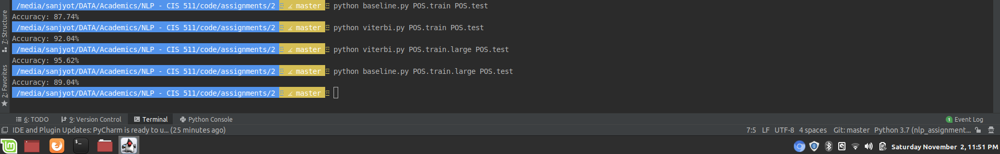

# Part-of-speech tagging using Viterbi algorithm
Implementation of Viterbi algorithm from scratch for tagging parts-of-speech.

## Dependencies
Make sure you have
- Numpy
- Pandas

## Usage
`$ python viterbi.py POS.train POS.test`

Program should output test accuracy on standard output. It will also generate the file `POS.test.out` that contains parts-of-speech predicted by the model.

## Results

